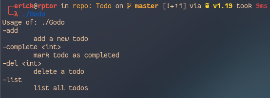
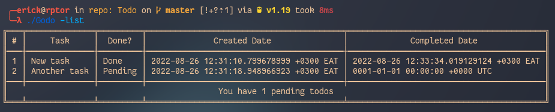

# Godo
A simple To-do CLI application written in Go


## Description
Godo is a To-Do CLI App written in Go tha gets it job done


## How to install
Ensure that go is installed properly on your machine

Clone this repository

run the following commands

```
$ go mod tidy

$ go build -o godo main.go

$ ./godo

```

If everything was successfull the program should launch on the help


## Screenshots




## Contribution
Godo is completely open source 
All help and bug reporting is welcome and appreciated
